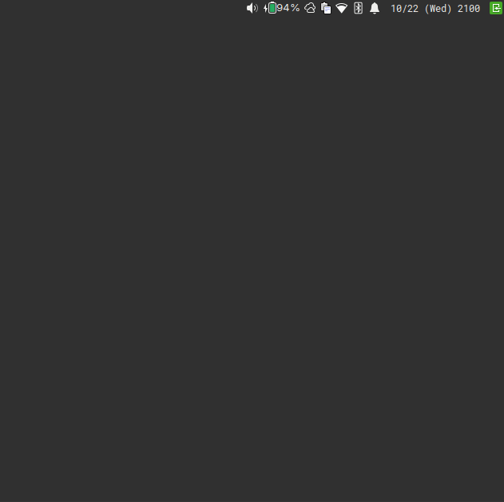

# panahone ⛅



simple gtk3 systray weather applet using [wttr.in](https://wttr.in/)'s API, written in Python.

## features

- 🌡️ **semi-realtime weather information** with automatic updates
- 💾 **smart caching** to reduce API calls (10-minute cache by default)
- 🔄 **auto-refresh** support (configurable interval)
- 🎨 **dynamic weather icons** that change based on conditions
- 📍 **location-based** weather (or auto-detect)
- 🌡️ **temperature units** (celsius/fahrenheit) with easy toggle
- 💨 **comprehensive weather data**:
  - current temperature and "feels like" temperature
  - weather conditions
  - humidity levels
  - wind speed and direction
  - uv index
  - visibility
- ⚙️ **persistent configuration** with JSON config file ***(EXPERIMENTAL)***
- 📝 **detailed logging** for debugging
- 🖱️ **interactive system tray**:
  - left click: fetch/refresh weather
  - middle click: quit
  - right click: context menu
- 🔔 **desktop notifications** with customizable timeout

## install

### system dependencies

- python 3.6+
- gtk3
- gobject
- libnotify

on Arch Linux:
```bash
sudo pacman -S python python-gobject gtk3 libnotify
```

on Ubuntu/Debian:
```bash
sudo apt install python3 python3-gi gir1.2-gtk-3.0 gir1.2-notify-0.7
```

on Fedora:
```bash
sudo dnf install python3 python3-gobject gtk3 libnotify
```

### in-app/venv Dependencies

```bash
cd src
pip install -r requirements.txt
```

## usage

```bash
# auto-detect location
./panahone

# specify location
./panahone -l "New York"

# use fahrenheit
./panahone -f

# enable debug logging
./panahone --debug
```

### cli args

```
-h, --help              Show help message
-l, --location LOCATION Specify location (city, coordinates, airport code)
-f, --fahrenheit        Use Fahrenheit instead of Celsius
-v, --version           Show version
--debug                 Enable debug logging
```

### mouse

- **left click**: fetch/refresh weather
- **middle click**: quit application
- **right click**: context menu (refresh, toggle units, about, quit)

## config (honestly, still experimental I would still use overrides at this point)

config file: `~/.config/panahone/config.json` (auto-created on first run)

```json
{
  "location": "",                    // default location (empty = auto-detect)
  "use_fahrenheit": false,           // temperature unit
  "auto_refresh": true,              // enable auto-updates
  "refresh_interval_minutes": 30,    // update frequency
  "show_wind": true,                 // show wind data
  "show_humidity": true,             // show humidity
  "show_feels_like": true,           // show "feels like" temp
  "notification_timeout": 10000      // notification duration (ms)
}
```

**file:**
- config: `~/.config/panahone/config.json`
- cache: `~/.cache/panahone/weather_cache.json`
- logs: `~/.cache/panahone/panahone.log`

## weather icons

`panahone` uses system theme icons and automatically maps weather conditions to appropriate icons (yaru would have all of these, but some icon themes may have some missing):

- ☀️ clear/sunny → `weather-clear`
- 🌤️ partly cloudy → `weather-few-clouds`
- ☁️ cloudy/overcast → `weather-overcast`
- 🌫️ fog/mist → `weather-fog`
- 🌧️ rain → `weather-showers`
- ⛈️ thunderstorm → `weather-storm`
- ❄️ snow/sleet → `weather-snow`

## troubleshooting

**Debug mode:**
```bash
./panahone --debug
cat ~/.cache/panahone/panahone.log
```
##  changelog (2025.10.22)

**improvements:**
- added persistent configuration system with json config file
- implemented smart caching to reduce api calls
- added auto-refresh functionality with configurable intervals
- enhanced weather display with humidity, wind, uv index, and visibility
- added dynamic weather icons that change based on conditions